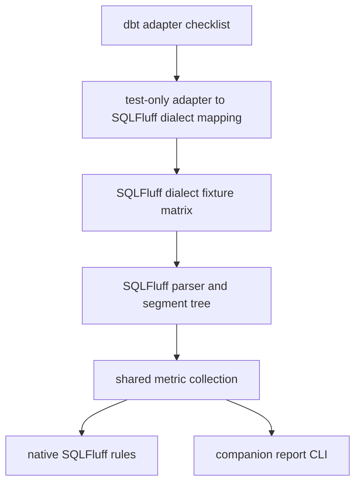

# ADR 0005: Validate SQL dialect support with fixture matrix

- **Status:** Accepted
- **Date:** 2026-05-01
- **Deciders:** Maintainers

## Context

`sqlfluff-complexity` derives metrics from SQLFluff parsed segment trees, and SQLFluff parser behavior can vary by dialect and release. The project needs confidence that core complexity semantics remain stable for the SQL dialects used by dbt analytics engineering teams without turning every pull request into an expensive warehouse-compatibility test suite.

The first fixture implementation established curated ANSI SQL files and expected metrics JSON. Planning then evaluated two scaling questions:

- whether to use `unittest`-style parallel execution or keep pytest as the test runner
- how to align dialect coverage with `dbt-labs/dbt-adapters` while still using SQLFluff dialect labels as the parser contract

dbt adapter package names are useful product-coverage signals, but they are not the same thing as SQLFluff dialect names. For example, Spark coverage maps to SQLFluff's `sparksql` dialect, while Databricks-specific syntax belongs under `databricks`.

## Decision

We will validate dialect-sensitive metric behavior with a curated SQL fixture matrix that uses SQLFluff dialect labels as the test contract.

The stable invariants are:

- Fixture paths are organized by SQLFluff dialect, not by dbt adapter package name.
- Expected metrics are stored as golden data where that makes semantic drift visible.
- Default pull request tests cover core behavior and ANSI fixtures; broader dialect coverage is marked as optional and runs through `dialect_extra` selection.
- dbt adapter names may inform coverage planning, but every fixture must declare the SQLFluff dialect used to parse it.
- Test execution should build on pytest, Nox orchestration, and CI matrix sharding rather than migrating the suite to `unittest`.

The intended relationship is:

## Consequences

- The project gets executable documentation for dialect assumptions around segment traversal.
- Parser drift becomes easier to identify because fixture failures point to a dialect and expected metric set.
- Pull request CI can remain fast while scheduled or manual jobs exercise broader dialect compatibility.
- Contributors need to understand the difference between dbt adapter names and SQLFluff dialect labels.
- The matrix will require ongoing maintenance as SQLFluff dialect support and project priorities evolve.

## Alternatives considered

- **ANSI fixtures only:** Keeps tests simple, but does not validate the cross-dialect risk identified by the segment-tree metric decision.
- **Run every dialect fixture in default PR CI:** Maximizes coverage on every change, but risks slow or flaky feedback as fixtures grow.
- **Migrate to `unittest` for parallel execution:** Follows a possible parallelism path, but adds framework churn to a pytest-native repository without improving SQLFluff fixture ergonomics.
- **Use dbt adapter names as fixture directories:** Familiar to dbt users, but obscures the actual parser contract and creates ambiguity for Spark, Databricks, Athena, and Trino-like syntax.
- **Use dbt manifest or adapter integration tests as the main dialect strategy:** Richer for dbt behavior, but conflicts with the v1 decision to avoid dbt manifest metrics and hard dbt dependencies.

## Trade-offs

We accept a curated, non-exhaustive dialect matrix instead of full warehouse-surface coverage. This keeps v1 maintainable while still testing the parser-sensitive behavior most likely to break shared metrics, native rules, and report output.

We also accept pytest-xdist, Nox session, and CI matrix complexity as the suite grows. The mitigation is to keep worker counts bounded in CI, centralize multi-Python orchestration in Nox, and reserve broad dialect jobs for scheduled or manual workflows until the cost is justified for pull requests.

## References

- [ADR 0002: Use SQLFluff plugin plus companion report CLI](0002-use-sqlfluff-plugin-plus-companion-report-cli.md)
- [ADR 0003: Derive complexity metrics from SQLFluff segment trees](0003-derive-complexity-metrics-from-sqlfluff-segment-trees.md)
- [ADR 0004: Defer dbt manifest metrics for v1](0004-defer-dbt-manifest-metrics-for-v1.md)
- [ADR 0006: Use Nox for multi-Python test orchestration](0006-use-nox-for-multi-python-test-orchestration.md)
- [Product design: risks and mitigations](../product_design.md#27-risks-and-mitigations)
- [README: test fixtures](../../README.md#test-fixtures)
