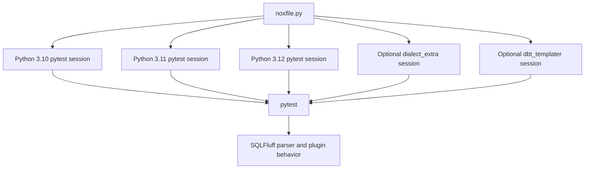

# ADR 0006: Use Nox for multi-Python test orchestration

- **Status:** Accepted
- **Date:** 2026-05-01
- **Deciders:** Maintainers

## Context

`sqlfluff-complexity` supports Python 3.10 and newer, and the test surface is expanding beyond a small default pytest suite into optional dialect fixtures and dbt templater compatibility checks. GitHub Actions can run a Python-version matrix, but keeping interpreter selection, optional marker selection, and local reproduction only in workflow YAML makes the test strategy harder to run consistently outside CI.

The project already uses pytest for assertions and SQLFluff integration behavior. The new requirement is not to replace pytest, but to orchestrate the same pytest suites across multiple Python interpreters and optional environments in a maintainable way.

Nox is designed for this role: it uses a standard `noxfile.py`, creates per-session virtual environments, selects requested Python interpreters, installs dependencies, and runs configured commands.

## Decision

We will use Nox as the canonical orchestration layer for multi-Python test sessions.

The stable invariants are:

- Pytest remains the test runner and owns assertions, markers, parametrization, and xdist worker behavior.
- Nox owns session orchestration across Python versions and optional test environments.
- Default Nox sessions run the fast test suite across supported Python versions and exclude optional markers such as `dialect_extra` and `dbt_templater`.
- Optional Nox sessions may run broader dialect fixtures and dbt templater compatibility tests with the extra dependencies they require.
- Runtime package dependencies stay separate from test orchestration dependencies; Nox should not introduce dbt or dialect-test packages into the core runtime dependency set.

The intended relationship is:

## Consequences

- Maintainers can reproduce CI's multi-Python test behavior locally with Nox rather than translating GitHub Actions matrix logic by hand.
- CI configuration can become thinner because interpreter/session logic lives in `noxfile.py`.
- Optional suites can be isolated behind explicit Nox sessions and markers, keeping default feedback fast.
- Contributors need Nox and the requested Python interpreters available to run the complete matrix locally.
- The repository has another development tool to maintain, but it replaces workflow-only orchestration rather than adding a second assertion framework.

## Alternatives considered

- **GitHub Actions matrix only:** Simple in CI, but weaker local reproducibility and more duplicated command logic across workflows.
- **tox:** Established for multi-environment testing, but Nox's Python-based configuration fits the project's preference for explicit, programmable orchestration.
- **Hatch environments/scripts:** Already compatible with Python packaging, but less directly aligned with the requested Nox workflow and multi-session Python orchestration.
- **Shell scripts only:** Easy to start, but brittle for interpreter matrices and optional dependency environments.
- **Run only the current Python locally:** Fastest, but does not validate the supported Python range.

## Trade-offs

We accept maintaining a `noxfile.py` and Nox-specific documentation to gain one shared place for local and CI test orchestration. The boundary is important: Nox coordinates environments and commands, while pytest, SQLFluff, and project fixtures define behavior.

## References

- [Nox documentation](https://nox.thea.codes/en/stable/)
- [ADR 0005: Validate SQL dialect support with fixture matrix](0005-validate-sql-dialect-support-with-fixture-matrix.md)
- [ADR 0004: Defer dbt manifest metrics for v1](0004-defer-dbt-manifest-metrics-for-v1.md)
- [Product design: Python support](../product_design.md#261-python)
