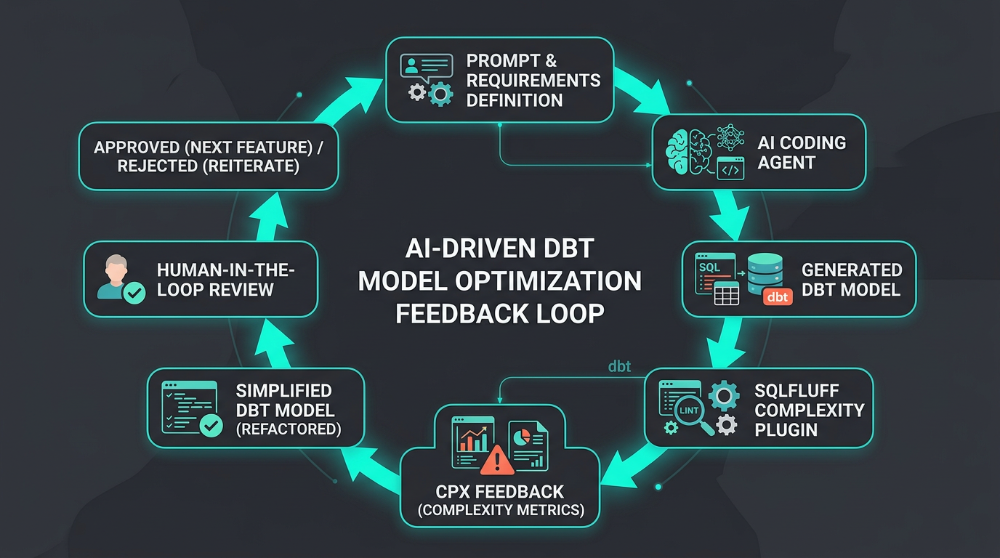
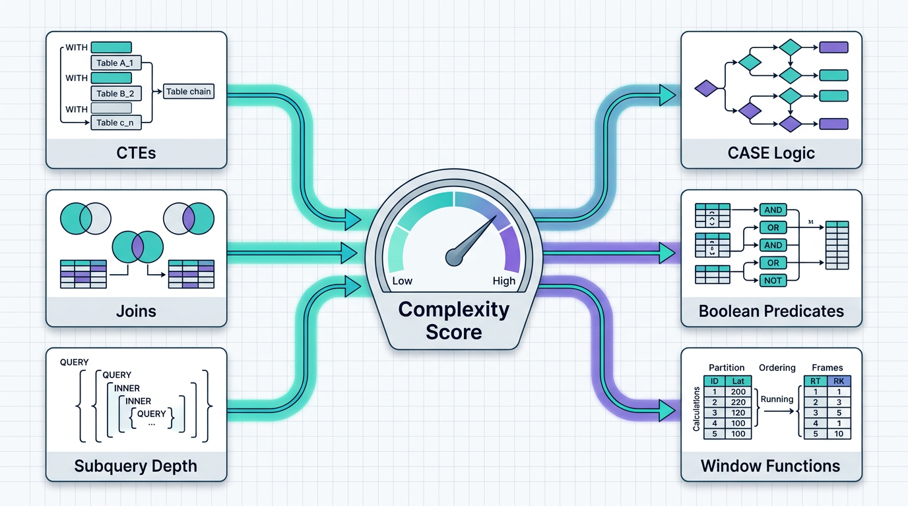

# AI Agents Need a Harness for dbt Models

How a custom SQLFluff plugin can give coding agents feedback before complex SQL reaches human review.


AI coding agents can generate dbt models in seconds. That is useful, but it also moves the bottleneck: the hard part is no longer writing SQL, it is reviewing whether the SQL should exist in that shape.

A model can compile, pass tests, and still be too complex for a human reviewer to trust.

That is the problem I kept running into in agent-assisted dbt work. The agent could produce runnable SQL quickly, but without a tight feedback loop it would often hand back a model that was technically valid and practically hard to review: too many CTEs, too many joins, dense `CASE` logic, or predicates that made the real business rule difficult to see.

This is where I think analytics engineering needs a different framing for static analysis. Linting is not only style enforcement anymore. In an agent workflow, static analysis can become part of the harness around the agent.

## What I Mean By An Agent Harness

By agent harness, I mean the feedback loop around an AI coding agent: the checks, tools, constraints, and signals that tell the agent whether its output is acceptable before a person reviews it.

For dbt and SQL work, that harness might include dbt compilation, unit tests, model contracts, SQLFluff style rules, warehouse-specific checks, documentation checks, and review conventions. None of those replace a human analytics engineer. They give the agent a better way to notice when its work is drifting away from what the team can maintain.



The important part is the loop:

1. A person asks an agent to build or refactor a model.
2. The agent writes SQL.
3. The harness checks the result.
4. The agent receives actionable feedback.
5. The agent simplifies the model before asking for review.

That changes the role of tooling. A check that used to say "this file fails lint" can now say "this is the next concrete thing the agent should fix."

## Valid SQL Is Not Enough

SQL complexity is not a theoretical concern in dbt projects. It shows up in everyday review:

- A chain of CTEs hides which transformation stages deserve names.
- A large join fan-in makes lineage and row multiplication harder to reason about.
- Nested subqueries make it difficult to see the actual shape of the data.
- Dense `CASE` expressions embed business rules directly in one file.
- Large boolean predicates are easy to misread and hard to test by inspection.
- Window-heavy statements can pack several analytic ideas into one model.

Humans can learn a team's taste for these tradeoffs. Agents need the taste encoded as feedback.

That does not mean every complex query is wrong. Sometimes complexity is intentional. The goal is not to ban it; the goal is to make complexity visible early enough that the author, whether human or agent, has to justify it.

## The Case Study: sqlfluff-complexity

[`sqlfluff-complexity`](../../README.md) is a SQLFluff plugin for finding SQL and dbt models that are too complex to review comfortably. It adds CPX rules for CTE count, join count, nested subquery depth, `CASE` expressions, boolean predicates, window functions, and an aggregate weighted complexity score.

The plugin works through SQLFluff's parser. In dbt projects, that means it fits into the existing SQLFluff/dbt templater workflow and measures SQL that SQLFluff can parse. It does not try to score the dbt DAG, read `manifest.json` directly, or understand business meaning. Those are different problems.

The useful thing for an agent is that CPX feedback is specific:

```text
CPX_C102: join count 12 exceeds max_joins=8.
CPX_C201: aggregate complexity score 74 exceeds max_complexity_score=60.
```

That gives the agent a concrete next move. Split the model. Extract an intermediate relation. Name the transformation stage. Move a classification rule into a mapping model. Or explain why the complexity is intentional.

## A Copyable SQLFluff Configuration

Here is a small `.sqlfluff` example for a dbt project. The thresholds are deliberately ordinary starting points, not universal limits.

```ini
[sqlfluff]
dialect = postgres
templater = dbt
rules = CPX_C101,CPX_C102,CPX_C103,CPX_C104,CPX_C105,CPX_C106,CPX_C201

[sqlfluff:templater:dbt]
project_dir = .
profiles_dir = ~/.dbt
profile = my_project
target = dev
dbt_skip_compilation_error = False

[sqlfluff:rules:CPX_C101]
max_ctes = 8

[sqlfluff:rules:CPX_C102]
max_joins = 8

[sqlfluff:rules:CPX_C103]
max_subquery_depth = 3

[sqlfluff:rules:CPX_C104]
max_case_expressions = 10

[sqlfluff:rules:CPX_C105]
max_boolean_operators = 20

[sqlfluff:rules:CPX_C106]
max_window_functions = 10

[sqlfluff:rules:CPX_C201]
max_complexity_score = 60
complexity_weights = ctes:2,joins:2,subquery_depth:4,case_expressions:2,boolean_operators:1,window_functions:2
mode = enforce
```

Then run the normal SQLFluff command:

```bash
sqlfluff lint models/
```

For teams that want to calibrate before enforcing, the companion report command can be used as a non-blocking signal:

```bash
sqlfluff-complexity report --dialect postgres --config .sqlfluff models/
```

The project docs include more detail on [configuration](../configuration.md), [dbt usage](../dbt.md), [rule meanings](../rules.md), and [report mode](../reporting.md).

## What The Signals Mean

The plugin does not try to understand whether a metric is good or bad in isolation. It asks review-oriented questions:

- How many CTEs does this statement contain?
- How many joins does it perform?
- How deeply are subqueries nested?
- How much `CASE` and boolean logic is embedded inline?
- How many window functions are packed into one statement?
- What is the aggregate complexity score?



Those questions are useful because they are close to how analytics engineers review SQL. A reviewer may not care that the score is exactly 74. They care that the score points to a model where several sources of review difficulty have accumulated.

## The Agent Workflow

Here is the workflow I want from an AI coding agent working on dbt models:

1. Make the requested change.
2. Run SQLFluff with CPX rules enabled.
3. Treat CPX failures as refactoring feedback.
4. Re-run the check.
5. Hand off the pull request with either simpler SQL or a clear explanation of why the remaining complexity is intentional.

This can be turned into a short agent instruction:

```markdown
Before handing off dbt model changes, run SQLFluff with CPX rules enabled.
If any CPX rule fails, simplify the model or explain why the complexity is intentional.
Prefer extracting named intermediate models over leaving large joins, deep subqueries,
or dense business logic in a single SQL file.
```

That instruction is intentionally small. The harness should make the right behavior easy, not bury the agent in a policy document.

## The Gap Is Narrow, But Real

I did not build this because SQL tooling is empty. SQLFluff, dbt, warehouse query analyzers, semantic-layer tooling, and CI checks already solve important problems.

The gap I kept running into was narrower: I wanted a dbt-friendly static feedback signal that an AI coding agent could use to notice when a model was becoming too complex to review.

That distinction matters. `sqlfluff-complexity` is not a replacement for dbt tests, model contracts, code review, observability, or good modeling judgment. It is a reviewability signal. It gives both agents and humans a shared vocabulary for one question:

> Is this SQL still small enough to reason about?

## How I Would Roll This Out

I would not start by failing every existing model in CI.

Start in report mode. Look at the models that already feel painful to review and see whether the signals match your intuition. Set generous thresholds first. Tighten rules where ownership is mature. Use path overrides if staging models and marts deserve different budgets. Let exceptions be explicit.

Most importantly, make the agent run the check before handoff. The best time to simplify generated SQL is before a reviewer has already spent twenty minutes reconstructing the model in their head.

## Faster SQL Needs Faster Feedback

The future of analytics engineering is not just faster SQL generation. It is faster feedback.

If agents are going to write dbt models with us, they need the same review signals we wish every human author had before opening a pull request. Static analysis is one practical way to provide those signals. `sqlfluff-complexity` is my attempt to make one part of that harness concrete.
