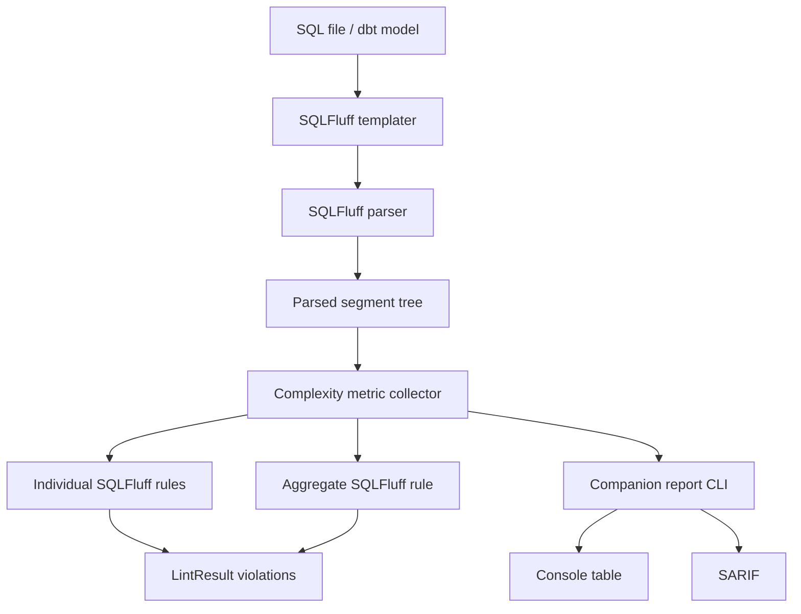
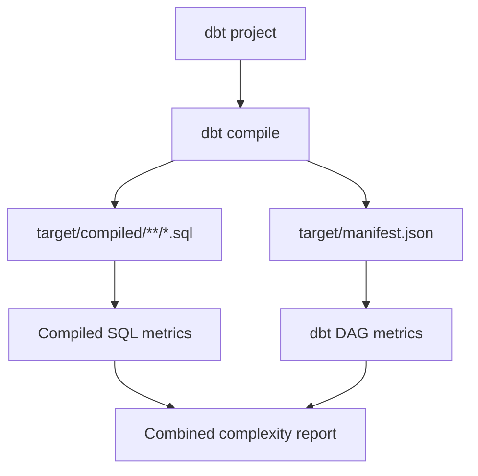
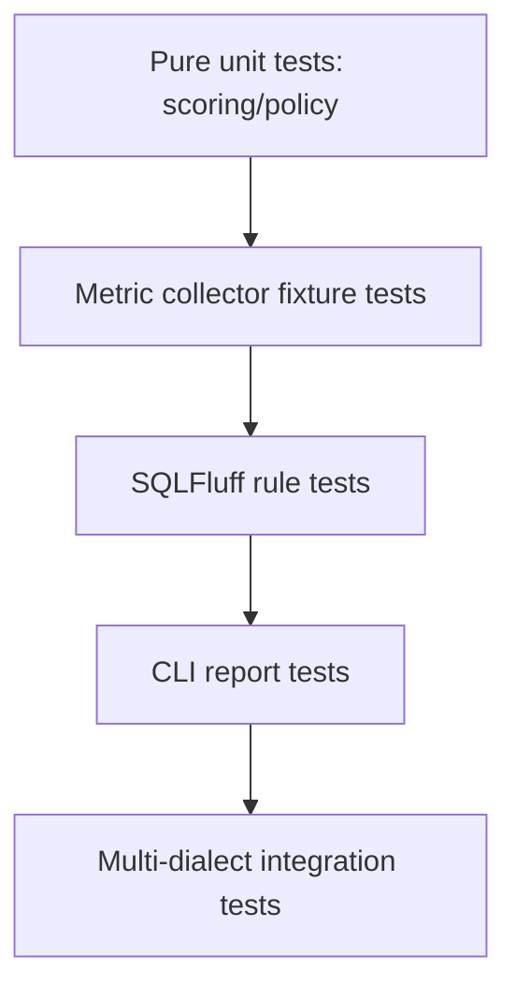

# Product Design: sqlfluff-complexity

**Document status:** Draft v0.1  
**Target repository:** `https://github.com/yu-iskw/sqlfluff-complexity`  
**Product name:** `sqlfluff-complexity`  
**Primary audience:** dbt analytics engineering teams, data platform teams, SQLFluff users, maintainers  
**Primary goal:** Implement a maintainable custom SQLFluff plugin for SQL/dbt complexity enforcement and reporting.

---

## 1. Executive Summary

`sqlfluff-complexity` will be a custom SQLFluff plugin that detects overly complex SQL statements, with a practical focus on dbt model maintainability.

The first production version should provide two complementary capabilities:

1. **Strict lint enforcement** through native SQLFluff rules.
2. **Report mode** through a companion command that emits a developer-readable console report and SARIF for CI/code-scanning workflows.

The plugin will expose both:

- **individual metric rules** for clear, actionable violations, and
- **one aggregate weighted-score rule** for enforcing a model-level complexity budget.

The first metric set will cover:

| Category              | Metrics                                                                |
| --------------------- | ---------------------------------------------------------------------- |
| Structural complexity | CTE count, join count, nested subquery depth                           |
| Expression complexity | `CASE` expression count, boolean operator count, window function count |
| Aggregate complexity  | weighted total score derived from the above metrics                    |

The design intentionally prioritizes:

1. **Long-term maintainability across SQLFluff upgrades**
2. **Developer and CI reporting experience**
3. **Metric accuracy**
4. **Fast implementation**

The plugin should support multiple SQL dialects from day one by relying primarily on SQLFluff’s parsed segment tree rather than dialect-specific string matching.

---

## 2. Background and Problem Statement

### 2.1 Current repository state

The repository was initialized from a Python package template and is being reshaped into `sqlfluff-complexity`. The GitHub repository is public, has an Apache-2.0 license, and keeps modern Python tooling including `uv`, Hatchling, Trunk, Ruff, Pyright, Pylint, Bandit, pytest, CodeQL, and dependency/security scanners.

The current implementation slice is turning that foundation into an installable SQLFluff plugin package.

### 2.2 Problem

SQLFluff is strong at SQL linting, formatting, templating, and rule-based static analysis. However, dbt projects often accumulate large models with many joins, CTEs, `CASE` expressions, nested subqueries, and dense boolean predicates. These problems are not always caught by style-oriented linting rules.

The team wants a “McCabe-like” guardrail for SQL/dbt models: not a literal cyclomatic complexity clone, but an enforceable signal that a model is likely too hard to review, test, optimize, or maintain.

### 2.3 Why a SQLFluff plugin

A SQLFluff plugin is appropriate because:

- SQLFluff already parses SQL into a structured segment tree.
- SQLFluff is commonly used in dbt projects.
- SQLFluff supports plugin-based custom rules through Python package entry points.
- Violations can be emitted as normal SQLFluff lint results.
- Standard SQLFluff suppression mechanisms such as `noqa` can be reused.
- Developers can run the plugin locally with their normal lint workflow.

SQLFluff’s custom-rule documentation recommends using the official example plugin as the starting point, and plugin discovery depends on Python packaging metadata via the SQLFluff entry point.

---

## 3. Goals and Non-Goals

### 3.1 Goals

#### G1. Native SQLFluff enforcement

The plugin must expose native SQLFluff rules that can fail lint in local development, pre-commit, and CI.

#### G2. Individual metric rules

The plugin must expose separate rule codes for the core metrics so violations are explainable and selectively suppressible.

#### G3. Aggregate weighted-score rule

The plugin must expose one aggregate complexity rule that combines core metrics into a weighted score.

#### G4. Report mode

The project must include report mode for non-blocking analysis and CI artifact generation. v1 report outputs are:

- console table
- SARIF

#### G5. Multi-dialect compatibility

The first version should work across SQLFluff-supported dialects as much as possible. The implementation should prefer SQLFluff segment types and parse-tree traversal over raw SQL regular expressions.

#### G6. dbt-compatible first, dbt-aware later

The first version should work with SQLFluff’s dbt templater and Jinja-templated SQL, but it should not require a hard dbt dependency. Later versions may add dbt manifest analysis for DAG-aware metrics.

#### G7. Configurable thresholds

Thresholds and weights should support:

- global defaults
- path-specific overrides

This allows different complexity budgets for staging, intermediate, marts, and sandbox directories.

#### G8. Maintainable internals

The core metric collection logic must be centralized so rules, reports, and future dbt-aware features use the same implementation.

### 3.2 Non-Goals for v1

#### NG1. Autofix

Complexity violations are not safely autofixable. Rules should set `is_fix_compatible = False`.

#### NG2. Full semantic SQL understanding

The plugin will not attempt to understand query execution plans, relation cardinality, cost-based optimizer behavior, or warehouse-specific performance semantics.

#### NG3. Full dbt DAG complexity

v1 will not require parsing `manifest.json`, resolving `ref()`/`source()` fan-in, or understanding model layering. These are future extensions.

#### NG4. Custom waiver system

v1 will not implement a separate waiver file or custom justification system. It will rely on standard SQLFluff suppression and configuration mechanisms.

#### NG5. Perfect cross-dialect equivalence

The plugin should aim for robust multi-dialect behavior, but some dialect-specific parse differences are expected. The mitigation is fixture-driven compatibility testing.

---

## 4. User Personas

### 4.1 Analytics engineer

Wants fast local feedback before opening a pull request. Needs clear messages explaining why a model fails and how to fix it.

### 4.2 Data platform engineer

Wants CI-enforced guardrails that prevent unmaintainable dbt models from entering the main branch. Needs configurable policies and stable tooling.

### 4.3 Code reviewer

Wants objective complexity signals to reduce subjective review comments such as “this model feels too complicated.”

### 4.4 Engineering manager / data lead

Wants metrics and reports that show complexity trends and identify refactoring candidates.

### 4.5 Plugin maintainer

Wants a codebase that is small, tested, typed, and resilient to SQLFluff API changes.

---

## 5. User Stories

### 5.1 Lint enforcement

As an analytics engineer, I want `sqlfluff lint` to fail when my query has too many joins so I can decompose it before review.

### 5.2 Aggregate complexity budget

As a data platform engineer, I want to set a maximum complexity score so complex models are blocked even when no single metric is extreme.

### 5.3 Path-specific policy

As a data platform engineer, I want stricter thresholds for staging models and looser thresholds for marts so policy matches model responsibilities.

### 5.4 Standard suppression

As an analytics engineer, I want to use normal SQLFluff `noqa` comments for justified exceptions.

### 5.5 Report mode

As a team lead, I want to generate a console report and SARIF artifact in CI so I can inspect complexity without necessarily failing the build.

### 5.6 Multi-dialect use

As a maintainer, I want the plugin to work for Snowflake, BigQuery, Spark/Databricks, Postgres, and Redshift projects without dialect-specific forks.

---

## 6. Product Scope

### 6.1 v1 scope

v1 includes:

- SQLFluff plugin package registration
- core complexity metric collector
- six individual metric rules
- one aggregate complexity rule
- default configuration
- path-specific override mechanism
- companion report command
- console report output
- SARIF report output
- tests for core metrics, rules, policy resolution, and reporting
- fixture coverage for representative SQL dialects

### 6.2 v2+ scope

Future releases may include:

- JSON report output
- dbt `manifest.json` ingestion
- dbt upstream fan-in / fan-out metrics
- model layer validation
- compiled SQL comparison
- trend reports across commits
- GitHub PR comments
- GitLab code quality output
- baseline mode for existing violations

---

## 7. Success Metrics

### 7.1 Functional success

- `sqlfluff rules` discovers all plugin rules after installation.
- Rules produce deterministic violations for fixture SQL files.
- `sqlfluff lint` can fail CI on complexity violations.
- Report command produces valid console output and SARIF.
- Standard `noqa` suppression works.

### 7.2 Developer experience success

- Violation messages include actual metric values and configured thresholds.
- Aggregate rule messages include full metric breakdown.
- README includes copy-pasteable installation, configuration, and CI examples.
- A developer can install and run the plugin in under 10 minutes.

### 7.3 Maintainability success

- Core metric logic is tested without invoking SQLFluff rule wrappers directly.
- Version-sensitive SQLFluff integration code is isolated.
- Rule classes are thin wrappers around shared metric collection.
- CI includes tests across supported Python versions and at least one pinned SQLFluff version.

### 7.4 Quality and security success

- `make lint`, `make test`, and `make build` pass.
- Type checking passes with Pyright.
- No high-confidence dead code from Vulture.
- No high-severity dependency or static-analysis findings.

---

## 8. Proposed Rule Set

### 8.1 Rule naming

Recommended public rule codes:

| Rule       | Name                                  | Purpose                                                |
| ---------- | ------------------------------------- | ------------------------------------------------------ |
| `CPX_C101` | Too many CTEs                         | Detect excessive `WITH` decomposition inside one model |
| `CPX_C102` | Too many joins                        | Detect high relational fan-in inside one statement     |
| `CPX_C103` | Nested subquery depth too high        | Detect deeply nested query structures                  |
| `CPX_C104` | Too many CASE expressions             | Detect dense embedded business logic                   |
| `CPX_C105` | Boolean predicate complexity too high | Detect complex `AND`/`OR` logic                        |
| `CPX_C106` | Too many window functions             | Detect dense analytic/window logic                     |
| `CPX_C201` | Aggregate complexity score too high   | Enforce total model complexity budget                  |

### 8.2 Default thresholds

Initial defaults should be conservative and easy to tune:

| Metric            | Default limit | Rationale                                                  |
| ----------------- | ------------: | ---------------------------------------------------------- |
| CTE count         |             8 | Long CTE chains often hide multiple transformation layers. |
| Join count        |             8 | Many joins increase review and correctness risk.           |
| Subquery depth    |             3 | Deep nesting sharply reduces readability.                  |
| CASE expressions  |            10 | Dense branching often represents embedded business rules.  |
| Boolean operators |            20 | Large predicates become difficult to validate.             |
| Window functions  |            10 | Many windows often indicate complex analytics logic.       |
| Aggregate score   |            60 | Allows moderate complexity while blocking extreme cases.   |

### 8.3 Default aggregate score

Default score formula:

```text
score =
  2 * cte_count
+ 2 * join_count
+ 4 * max_subquery_depth
+ 2 * case_expression_count
+ 1 * boolean_operator_count
+ 2 * window_function_count
```

Default weights:

| Metric              | Weight |
| ------------------- | -----: |
| `ctes`              |      2 |
| `joins`             |      2 |
| `subquery_depth`    |      4 |
| `case_expressions`  |      2 |
| `boolean_operators` |      1 |
| `window_functions`  |      2 |

### 8.4 Why individual rules plus aggregate rule

Individual rules make failures actionable:

> `CPX_C102: join count 12 exceeds max_joins=8.`

The aggregate rule catches distributed complexity:

> `CPX_C201: aggregate complexity score 72 exceeds max_complexity_score=60. Metrics: ctes=6, joins=6, subquery_depth=2, case=8, boolean_ops=12, windows=4.`

A query may pass all individual thresholds but still be too complex overall. Conversely, a single mild threshold violation can be selectively suppressed without disabling the aggregate policy.

---

## 9. System Architecture

### 9.1 High-level architecture



### 9.2 Component responsibilities

| Component             | Responsibility                                                  |
| --------------------- | --------------------------------------------------------------- |
| SQLFluff plugin hooks | Register rules and default config with SQLFluff.                |
| Rule classes          | Thin wrappers that evaluate thresholds and emit `LintResult`.   |
| Metric collector      | Traverse SQLFluff segment tree and produce `ComplexityMetrics`. |
| Scoring module        | Parse weights and compute aggregate score.                      |
| Policy resolver       | Merge global config and path-specific overrides.                |
| Report CLI            | Run analysis in report mode and emit console/SARIF.             |
| SARIF writer          | Convert metrics and violations into SARIF results.              |
| Tests                 | Validate rules, metrics, reports, and policy behavior.          |

### 9.3 Design principle

The core invariant:

> Rules and reports must use the same metric engine.

This prevents enforcement and reporting from drifting apart.

---

## 10. Repository Structure

The package source lives under `src/sqlfluff_complexity`.

Recommended structure:

```text
sqlfluff-complexity/
  pyproject.toml
  README.md
  LICENSE
  AGENTS.md
  Makefile
  docs/
    product-design.md
    adr/
      0001-use-sqlfluff-plugin-plus-report-cli.md
      0002-use-segment-tree-metrics.md
      0003-defer-dbt-manifest-metrics.md
  src/
    sqlfluff_complexity/
      __init__.py
      py.typed
      plugin_default_config.cfg
      cli.py
      core/
        __init__.py
        metrics.py
        segment_tree.py
        scoring.py
        policy.py
        paths.py
        violations.py
      rules/
        __init__.py
        c101_too_many_ctes.py
        c102_too_many_joins.py
        c103_subquery_depth.py
        c104_too_many_case.py
        c105_boolean_complexity.py
        c106_too_many_windows.py
        c201_aggregate_score.py
        base.py
      reporting/
        __init__.py
        console.py
        sarif.py
        model.py
      tests/
        core/
          test_metrics.py
          test_scoring.py
          test_policy.py
        rules/
          test_c101_too_many_ctes.py
          test_c102_too_many_joins.py
          test_c103_subquery_depth.py
          test_c104_too_many_case.py
          test_c105_boolean_complexity.py
          test_c106_too_many_windows.py
          test_c201_aggregate_score.py
        reporting/
          test_console.py
          test_sarif.py
        fixtures/
          ansi/
          snowflake/
          bigquery/
          postgres/
          spark/
```

### 10.1 Colocated tests

Tests stay under `src/sqlfluff_complexity/tests`, matching the current package layout and avoiding an immediate build-system redesign.

### 10.2 Documentation files

Recommended documentation:

| File                     | Purpose                                        |
| ------------------------ | ---------------------------------------------- |
| `README.md`              | User installation, configuration, and examples |
| `docs/product-design.md` | This product design                            |
| `docs/adr/0001-...md`    | Architecture decision records                  |
| `docs/rule-reference.md` | Detailed rule behavior and examples            |
| `docs/reporting.md`      | SARIF and console report guide                 |
| `docs/development.md`    | Maintainer development guide                   |

---

## 11. Packaging Design

### 11.1 `pyproject.toml`

The repository currently uses Hatchling. The plugin should keep Hatchling unless there is a strong reason to change.

Proposed key changes:

```toml
[project]
name = "sqlfluff-complexity"
version = "0.1.0"
description = "SQLFluff plugin for SQL and dbt model complexity rules"
authors = [{ name = "yu-iskw" }]
readme = "README.md"
license = { file = "LICENSE" }
requires-python = ">=3.10.0"
dependencies = [
  "sqlfluff>=3.0.0,<4.0.0",
]

[project.optional-dependencies]
report = [
  "rich>=13.0.0",
]
dbt = [
  "sqlfluff-templater-dbt>=3.0.0,<4.0.0",
]
dev = [
  "pytest>=8.0.0",
  "ruff>=0.15.0",
  "pyright>=1.1.0",
  "pylint>=3.0.0",
  "bandit>=1.8.0",
]

[project.scripts]
sqlfluff-complexity = "sqlfluff_complexity.cli:main"

[project.entry-points.sqlfluff]
sqlfluff_complexity = "sqlfluff_complexity"

[tool.hatch.build.targets.wheel]
packages = ["src/sqlfluff_complexity"]

[tool.pytest.ini_options]
testpaths = ["src/sqlfluff_complexity/tests"]

[tool.pyright]
include = ["src"]
extraPaths = ["src"]
pythonVersion = "3.10"
typeCheckingMode = "standard"
```

### 11.2 Entry point

The critical entry point is:

```toml
[project.entry-points.sqlfluff]
sqlfluff_complexity = "sqlfluff_complexity"
```

SQLFluff discovers plugins through installed Python package metadata. Therefore, after changing entry points or package names, the package should be reinstalled:

```bash
uv pip install -e .
# or
pip install -e .
```

Then verify discovery:

```bash
sqlfluff rules | grep CPX
```

### 11.3 Package data

`plugin_default_config.cfg` must be included in the wheel. With Hatchling, configure package data if necessary:

```toml
[tool.hatch.build.targets.wheel.force-include]
"src/sqlfluff_complexity/plugin_default_config.cfg" = "sqlfluff_complexity/plugin_default_config.cfg"
```

Alternatively, verify that Hatchling includes it automatically under the package. This should be tested by building and installing the wheel.

---

## 12. SQLFluff Plugin Integration

### 12.1 Plugin hooks

`src/sqlfluff_complexity/__init__.py` should implement SQLFluff plugin hooks:

```python
from __future__ import annotations

from typing import Any

from sqlfluff.core.config import load_config_resource
from sqlfluff.core.plugin import hookimpl
from sqlfluff.core.rules import BaseRule, ConfigInfo


@hookimpl
def get_rules() -> list[type[BaseRule]]:
    """Register SQLFluff complexity rules."""
    from sqlfluff_complexity.rules.c101_too_many_ctes import Rule_CPX_C101
    from sqlfluff_complexity.rules.c102_too_many_joins import Rule_CPX_C102
    from sqlfluff_complexity.rules.c103_subquery_depth import Rule_CPX_C103
    from sqlfluff_complexity.rules.c104_too_many_case import Rule_CPX_C104
    from sqlfluff_complexity.rules.c105_boolean_complexity import Rule_CPX_C105
    from sqlfluff_complexity.rules.c106_too_many_windows import Rule_CPX_C106
    from sqlfluff_complexity.rules.c201_aggregate_score import Rule_CPX_C201

    return [
        Rule_CPX_C101,
        Rule_CPX_C102,
        Rule_CPX_C103,
        Rule_CPX_C104,
        Rule_CPX_C105,
        Rule_CPX_C106,
        Rule_CPX_C201,
    ]


@hookimpl
def load_default_config() -> dict[str, Any]:
    """Load plugin default configuration."""
    return load_config_resource(
        package="sqlfluff_complexity",
        file_name="plugin_default_config.cfg",
    )


@hookimpl
def get_configs_info() -> dict[str, dict[str, ConfigInfo]]:
    """Expose plugin configuration metadata."""
    return {
        "max_ctes": {"definition": "Maximum CTEs allowed in one statement."},
        "max_joins": {"definition": "Maximum JOIN clauses allowed in one statement."},
        "max_subquery_depth": {"definition": "Maximum nested subquery depth allowed."},
        "max_case_expressions": {"definition": "Maximum CASE expressions allowed."},
        "max_boolean_operators": {"definition": "Maximum AND/OR operators allowed."},
        "max_window_functions": {"definition": "Maximum window functions allowed."},
        "max_complexity_score": {"definition": "Maximum aggregate complexity score."},
        "complexity_weights": {"definition": "Comma-separated complexity weights."},
        "mode": {"definition": "Rule mode: enforce or report."},
        "path_overrides": {"definition": "Path-specific complexity policy overrides."},
    }
```

### 12.2 Rule class pattern

Each rule should:

- inherit `BaseRule`
- define `groups`
- define `config_keywords`
- define `crawl_behaviour`
- set `is_fix_compatible = False`
- evaluate the current segment using shared metric collection
- return `None` when passing
- return `LintResult` with a custom description when failing

Example:

```python
from __future__ import annotations

from sqlfluff.core.rules import BaseRule, LintResult, RuleContext
from sqlfluff.core.rules.crawlers import SegmentSeekerCrawler

from sqlfluff_complexity.core.segment_tree import collect_metrics


class Rule_CPX_C102(BaseRule):
    """Query contains too many JOIN clauses."""

    groups = ("all", "complexity")
    config_keywords = ["max_joins"]
    crawl_behaviour = SegmentSeekerCrawler({"select_statement"})
    is_fix_compatible = False

    def _eval(self, context: RuleContext) -> LintResult | None:
        metrics = collect_metrics(context.segment)
        limit = int(self.max_joins)

        if metrics.joins <= limit:
            return None

        return LintResult(
            anchor=context.segment,
            description=(
                f"CPX_C102: join count {metrics.joins} exceeds max_joins={limit}. "
                "Consider decomposing the model or moving joins upstream."
            ),
        )
```

### 12.3 Trigger segment choice

Initial recommendation:

```python
crawl_behaviour = SegmentSeekerCrawler({"select_statement"})
```

This keeps rule evaluation statement-scoped and reduces duplicate violations.

Alternative trigger segments may be needed after fixture validation:

| Rule            | Candidate trigger                             |
| --------------- | --------------------------------------------- |
| CTE count       | `with_compound_statement`, `select_statement` |
| Join count      | `select_statement`                            |
| Subquery depth  | `select_statement`                            |
| CASE count      | `select_statement`                            |
| Boolean count   | `select_statement`                            |
| Window count    | `select_statement`                            |
| Aggregate score | `select_statement`                            |

The development workflow should use:

```bash
sqlfluff parse path/to/query.sql --dialect snowflake
```

to inspect segment names and refine traversal logic.

---

## 13. Core Metric Model

### 13.1 `ComplexityMetrics`

```python
from __future__ import annotations

from dataclasses import dataclass


@dataclass(frozen=True)
class ComplexityMetrics:
    """Complexity metrics for one SQL statement."""

    ctes: int = 0
    joins: int = 0
    subqueries: int = 0
    subquery_depth: int = 0
    case_expressions: int = 0
    boolean_operators: int = 0
    window_functions: int = 0

    def score(self, weights: dict[str, int]) -> int:
        """Compute weighted aggregate complexity score."""
        return (
            self.ctes * weights.get("ctes", 0)
            + self.joins * weights.get("joins", 0)
            + self.subquery_depth * weights.get("subquery_depth", 0)
            + self.case_expressions * weights.get("case_expressions", 0)
            + self.boolean_operators * weights.get("boolean_operators", 0)
            + self.window_functions * weights.get("window_functions", 0)
        )
```

### 13.2 `ComplexityFinding`

For report mode, use a normalized internal finding model:

```python
from __future__ import annotations

from dataclasses import dataclass
from pathlib import Path

from sqlfluff_complexity.core.metrics import ComplexityMetrics


@dataclass(frozen=True)
class SourceLocation:
    path: Path
    line: int
    column: int


@dataclass(frozen=True)
class ComplexityFinding:
    rule_id: str
    message: str
    location: SourceLocation
    metrics: ComplexityMetrics
    score: int | None
    level: str  # "note", "warning", or "error"
```

The SQLFluff rule path can emit `LintResult` directly, while the report path can convert findings to console rows or SARIF.

---

## 14. Segment Traversal Design

### 14.1 Segment-type matching

Preferred metric extraction:

| Metric                 | Preferred signal                                                | Fallback                               |
| ---------------------- | --------------------------------------------------------------- | -------------------------------------- |
| CTE count              | segment type `common_table_expression`                          | parse-tree fixture refinement          |
| Join count             | segment type `join_clause`                                      | keyword `JOIN` only as last resort     |
| CASE count             | segment type `case_expression`                                  | raw keyword `CASE` only as last resort |
| Boolean operator count | keyword segments `AND`, `OR` in expressions                     | raw matching with context filter       |
| Window count           | segment type `over_clause`                                      | function segment containing `OVER`     |
| Subquery depth         | nested `select_statement` under bracket/expression/from element | conservative depth algorithm           |

### 14.2 Traversal implementation sketch

```python
from __future__ import annotations

from collections.abc import Iterable

from sqlfluff.core.parser.segments.base import BaseSegment

from sqlfluff_complexity.core.metrics import ComplexityMetrics


BOOLEAN_OPERATORS = {"AND", "OR"}


def iter_segments(segment: BaseSegment) -> Iterable[BaseSegment]:
    """Depth-first traversal of a SQLFluff segment tree."""
    yield segment
    for child in getattr(segment, "segments", ()) or ():
        yield from iter_segments(child)


def collect_metrics(root: BaseSegment) -> ComplexityMetrics:
    """Collect complexity metrics from a SQLFluff segment tree."""
    counter = _MetricCounter()
    counter.walk(root)
    return counter.to_metrics()


class _MetricCounter:
    """Stateful helper for metric collection.

    Kept private so SQLFluff-version-sensitive behavior is isolated.
    """

    def __init__(self) -> None:
        self.ctes = 0
        self.joins = 0
        self.subqueries = 0
        self.subquery_depth = 0
        self.case_expressions = 0
        self.boolean_operators = 0
        self.window_functions = 0

    def walk(self, segment: BaseSegment, nested_select_depth: int = 0) -> None:
        segment_type = getattr(segment, "type", "")
        raw_upper = getattr(segment, "raw_upper", "").upper()

        if segment_type == "common_table_expression":
            self.ctes += 1
        elif segment_type == "join_clause":
            self.joins += 1
        elif segment_type == "case_expression":
            self.case_expressions += 1
        elif segment_type == "over_clause":
            self.window_functions += 1
        elif raw_upper in BOOLEAN_OPERATORS and self._is_boolean_operator(segment):
            self.boolean_operators += 1

        next_depth = nested_select_depth
        if self._is_nested_select(segment, nested_select_depth):
            self.subqueries += 1
            next_depth += 1
            self.subquery_depth = max(self.subquery_depth, next_depth)

        for child in getattr(segment, "segments", ()) or ():
            self.walk(child, next_depth)

    def _is_boolean_operator(self, segment: BaseSegment) -> bool:
        """Return true when a keyword segment represents expression logic."""
        # v1 can start simple. Fixture tests should refine this if AND/OR appears
        # in non-expression contexts for supported dialects.
        return True

    def _is_nested_select(self, segment: BaseSegment, current_depth: int) -> bool:
        """Return true when a select statement is nested inside another query."""
        if getattr(segment, "type", "") != "select_statement":
            return False
        return current_depth > 0 or _has_nested_select_parent(segment)

    def to_metrics(self) -> ComplexityMetrics:
        return ComplexityMetrics(
            ctes=self.ctes,
            joins=self.joins,
            subqueries=self.subqueries,
            subquery_depth=self.subquery_depth,
            case_expressions=self.case_expressions,
            boolean_operators=self.boolean_operators,
            window_functions=self.window_functions,
        )


def _has_nested_select_parent(segment: BaseSegment) -> bool:
    """Best-effort nested SELECT detection.

    This function intentionally isolates parent-sensitive SQLFluff logic.
    It must be validated with parse fixtures before production use.
    """
    parent = getattr(segment, "parent", None)
    while parent is not None:
        parent_type = getattr(parent, "type", "")
        if parent_type in {"bracketed", "expression", "from_expression_element"}:
            return True
        parent = getattr(parent, "parent", None)
    return False
```

### 14.3 Important implementation caution

SQLFluff internals may differ across versions. Parent pointers and exact segment names should not be assumed without tests.

Mitigation:

- keep traversal in `core/segment_tree.py`
- add parser fixture tests for every supported metric
- support a pinned SQLFluff major version range initially
- use CI to test against the latest supported SQLFluff release

---

## 15. Scoring Design

### 15.1 Weight parser

Configuration string:

```ini
complexity_weights = ctes:2,joins:2,subquery_depth:4,case_expressions:2,boolean_operators:1,window_functions:2
```

Parser behavior:

- split by comma
- split entries by colon
- trim whitespace
- reject unknown metric names
- reject negative weights
- reject non-integer weights
- use defaults for missing weights only if explicitly allowed

Example:

```python
from __future__ import annotations

VALID_WEIGHT_KEYS = {
    "ctes",
    "joins",
    "subquery_depth",
    "case_expressions",
    "boolean_operators",
    "window_functions",
}


def parse_weights(raw: str) -> dict[str, int]:
    """Parse complexity weight configuration."""
    weights: dict[str, int] = {}
    for item in raw.split(","):
        item = item.strip()
        if not item:
            continue
        key, sep, value = item.partition(":")
        if sep != ":":
            msg = f"Invalid weight item {item!r}; expected key:value."
            raise ValueError(msg)
        key = key.strip()
        value = value.strip()
        if key not in VALID_WEIGHT_KEYS:
            msg = f"Unknown complexity weight key {key!r}."
            raise ValueError(msg)
        parsed_value = int(value)
        if parsed_value < 0:
            msg = f"Complexity weight for {key!r} must be non-negative."
            raise ValueError(msg)
        weights[key] = parsed_value
    return weights
```

### 15.2 Score interpretation

|   Score | Meaning     | Suggested action                            |
| ------: | ----------- | ------------------------------------------- |
|  `0–20` | Simple      | Allow                                       |
| `21–40` | Moderate    | Allow                                       |
| `41–60` | Complex     | Allow or review carefully                   |
|   `61+` | Too complex | Fail unless suppressed or policy overridden |

v1 should not hard-code these bands except as documentation. Enforcement uses configured thresholds.

---

## 16. Configuration Design

### 16.1 Default config file

`src/sqlfluff_complexity/plugin_default_config.cfg`:

```ini
[sqlfluff:rules:CPX_C101]
max_ctes = 8

[sqlfluff:rules:CPX_C102]
max_joins = 8

[sqlfluff:rules:CPX_C103]
max_subquery_depth = 3

[sqlfluff:rules:CPX_C104]
max_case_expressions = 10

[sqlfluff:rules:CPX_C105]
max_boolean_operators = 20

[sqlfluff:rules:CPX_C106]
max_window_functions = 10

[sqlfluff:rules:CPX_C201]
max_complexity_score = 60
complexity_weights = ctes:2,joins:2,subquery_depth:4,case_expressions:2,boolean_operators:1,window_functions:2
mode = enforce
path_overrides =
```

### 16.2 User config example

`.sqlfluff`:

```ini
[sqlfluff]
dialect = snowflake
templater = dbt

[sqlfluff:templater:dbt]
project_dir = .
profiles_dir = ~/.dbt

[sqlfluff:rules]
groups = all,complexity

[sqlfluff:rules:CPX_C101]
max_ctes = 8

[sqlfluff:rules:CPX_C102]
max_joins = 8

[sqlfluff:rules:CPX_C103]
max_subquery_depth = 3

[sqlfluff:rules:CPX_C104]
max_case_expressions = 10

[sqlfluff:rules:CPX_C105]
max_boolean_operators = 20

[sqlfluff:rules:CPX_C106]
max_window_functions = 10

[sqlfluff:rules:CPX_C201]
max_complexity_score = 60
complexity_weights = ctes:2,joins:2,subquery_depth:4,case_expressions:2,boolean_operators:1,window_functions:2
mode = enforce
path_overrides =
    models/staging/*:max_complexity_score=45,max_joins=4,max_ctes=4
    models/intermediate/*:max_complexity_score=60
    models/marts/*:max_complexity_score=70,max_joins=10,max_ctes=10
    models/sandbox/*:mode=report
```

### 16.3 Path override semantics

Path override format:

```text
<glob>:key=value,key=value,key=value
```

Example:

```text
models/staging/*:max_complexity_score=45,max_joins=4,max_ctes=4
```

Rules:

1. Start with global defaults.
2. Evaluate path overrides against normalized POSIX-style paths.
3. If multiple overrides match, use the most specific pattern.
4. If specificity ties, use the last matching override.
5. Reject unknown override keys.
6. Reject invalid values.

### 16.4 `mode`

Supported values:

| Mode      | Meaning                                                                          |
| --------- | -------------------------------------------------------------------------------- |
| `enforce` | Emit lint violations when thresholds are exceeded.                               |
| `report`  | Do not emit lint violations from SQLFluff rules. Used for calibration/reporting. |

Important: the report CLI should be able to report findings regardless of SQLFluff rule mode.

---

## 17. Override and Suppression Design

### 17.1 Standard SQLFluff suppression

v1 should rely on SQLFluff-native mechanisms:

- inline `noqa`
- file-level or path-level SQLFluff rule configuration
- rule exclusion in `.sqlfluff`

Examples:

```sql
-- noqa: CPX_C201
select ...
```

```sql
select *
from very_complex_but_approved_model -- noqa: CPX_C102
```

Config-level exclusion:

```ini
[sqlfluff]
exclude_rules = CPX_C201
```

### 17.2 No custom waiver system in v1

No `.sqlfluff-complexity-waivers.yml` in v1.

Rationale:

- Standard SQLFluff suppression is already familiar.
- A waiver system adds governance semantics and maintenance burden.
- If needed later, waiver metadata can be added in v2+.

---

## 18. Report Mode Design

### 18.1 CLI interface

Recommended command:

```bash
sqlfluff-complexity report models \
  --dialect snowflake \
  --format console
```

SARIF:

```bash
sqlfluff-complexity report models \
  --dialect snowflake \
  --format sarif \
  --output sqlfluff-complexity.sarif
```

Optional flags:

```text
Usage: sqlfluff-complexity report [OPTIONS] PATHS...

Options:
  --dialect TEXT              SQLFluff dialect.
  --config PATH               SQLFluff config file.
  --format [console|sarif]    Report format.
  --output PATH               Output file for SARIF.
  --fail-on-error             Exit nonzero if failures are found.
  --include TEXT              Glob include pattern.
  --exclude TEXT              Glob exclude pattern.
  --verbose                   Enable verbose logging.
```

### 18.2 Console output

Example:

```text
SQLFluff Complexity Report

Path                                        CTE  Join  SubQDepth  CASE  Bool  Win  Score  Status
models/staging/stg_orders.sql                2     1          0     1     3    0     12  PASS
models/intermediate/int_customer_rollup.sql  7     6          2     8    17    4     55  PASS
models/marts/fct_revenue.sql                12    11          4    14    29    8     91  FAIL
```

### 18.3 SARIF output

SARIF fields:

| Internal field   | SARIF mapping                               |
| ---------------- | ------------------------------------------- |
| rule ID          | `ruleId`                                    |
| rule title       | `tool.driver.rules[].shortDescription.text` |
| detailed message | `results[].message.text`                    |
| file path        | `artifactLocation.uri`                      |
| line/column      | `region.startLine`, `region.startColumn`    |
| severity         | `level`                                     |

Minimal SARIF shape:

```json
{
  "version": "2.1.0",
  "$schema": "https://json.schemastore.org/sarif-2.1.0.json",
  "runs": [
    {
      "tool": {
        "driver": {
          "name": "sqlfluff-complexity",
          "rules": []
        }
      },
      "results": []
    }
  ]
}
```

### 18.4 Report mode and SQLFluff APIs

There are two possible implementations:

#### Option A: Use SQLFluff Python APIs directly

Pros:

- Reuses SQLFluff parser and config behavior.
- More integrated.

Cons:

- Python APIs may be less stable than CLI behavior.

#### Option B: Shell out to `sqlfluff parse` / `sqlfluff lint`

Pros:

- More stable CLI boundary.

Cons:

- Slower.
- Harder to access segment tree.

Recommended v1 approach:

- Use SQLFluff Python APIs behind a small adapter module.
- Keep the adapter isolated.
- Add integration tests that detect breaking SQLFluff changes early.

---

## 19. dbt Integration Design

### 19.1 v1 behavior

v1 should support dbt through SQLFluff configuration:

```ini
[sqlfluff]
templater = dbt

[sqlfluff:templater:dbt]
project_dir = .
profiles_dir = ~/.dbt
```

Users should install:

```bash
pip install sqlfluff-complexity sqlfluff-templater-dbt dbt-snowflake
```

or with `uv`:

```bash
uv add --dev sqlfluff-complexity sqlfluff-templater-dbt dbt-snowflake
```

### 19.2 v1 limitation

v1 metrics apply to the SQLFluff parse tree after templating, not necessarily to final compiled dbt SQL under `target/compiled`.

This means:

- macro-expanded complexity may be undercounted
- `ref()`/`source()` DAG fan-in is not counted directly
- generated SQL may differ from source-visible SQL

### 19.3 Future dbt-aware extension

Future flow:



Future metrics:

| Metric                      | Source                    |
| --------------------------- | ------------------------- |
| upstream ref count          | `manifest.json`           |
| source count                | `manifest.json`           |
| model fan-in                | `manifest.json`           |
| model fan-out               | `manifest.json`           |
| layer violations            | path + manifest metadata  |
| compiled/source score delta | source SQL + compiled SQL |

This should be implemented as an optional extra, not a hard dependency.

---

## 20. Detailed Rule Behavior

### 20.1 `CPX_C101`: Too many CTEs

#### Trigger

Evaluate once per `select_statement` or `with_compound_statement` after fixture validation.

#### Count

Count `common_table_expression` segments.

#### Default

`max_ctes = 8`

#### Violation message

```text
CPX_C101: CTE count 11 exceeds max_ctes=8. Consider splitting transformation layers into separate dbt models.
```

#### Edge cases (CPX_C101)

| Case                     | Expected behavior                                 |
| ------------------------ | ------------------------------------------------- |
| recursive CTE            | Count each CTE definition.                        |
| nested CTE in subquery   | Count if inside evaluated statement.              |
| templated CTE generation | Count what SQLFluff parser sees after templating. |

### 20.2 `CPX_C102`: Too many joins

#### Count (CPX_C102)

Count `join_clause` segments.

#### Default (CPX_C102)

`max_joins = 8`

#### Violation message (CPX_C102)

```text
CPX_C102: join count 12 exceeds max_joins=8. Consider decomposing the model or moving joins upstream.
```

#### Edge cases (CPX_C102)

| Case                   | Expected behavior                          |
| ---------------------- | ------------------------------------------ |
| implicit comma joins   | v1 may not count; document limitation.     |
| lateral joins          | count as joins if parsed as `join_clause`. |
| dialect-specific joins | rely on SQLFluff parser.                   |

### 20.3 `CPX_C103`: Nested subquery depth too high

#### Count (CPX_C103)

Track maximum depth of nested `select_statement` segments.

#### Default (CPX_C103)

`max_subquery_depth = 3`

#### Violation message (CPX_C103)

```text
CPX_C103: nested subquery depth 4 exceeds max_subquery_depth=3. Consider extracting nested logic into CTEs or intermediate models.
```

#### Edge cases (CPX_C103)

Subquery detection is the most likely metric to require dialect-specific fixture hardening.

### 20.4 `CPX_C104`: Too many CASE expressions

#### Count (CPX_C104)

Count `case_expression` segments.

#### Default (CPX_C104)

`max_case_expressions = 10`

#### Violation message (CPX_C104)

```text
CPX_C104: CASE expression count 14 exceeds max_case_expressions=10. Consider extracting business rules into upstream models or mapping tables.
```

### 20.5 `CPX_C105`: Boolean complexity too high

#### Count (CPX_C105)

Count boolean `AND` and `OR` operators in expression contexts.

#### Default (CPX_C105)

`max_boolean_operators = 20`

#### Violation message (CPX_C105)

```text
CPX_C105: boolean operator count 25 exceeds max_boolean_operators=20. Consider simplifying predicates or extracting filters into named CTEs.
```

#### Edge cases (CPX_C105)

- `BETWEEN ... AND ...` should ideally not count as boolean complexity.
- `AND` inside non-expression syntax should not count.
- This needs fixture coverage.

### 20.6 `CPX_C106`: Too many window functions

#### Count (CPX_C106)

Count `over_clause` segments.

#### Default (CPX_C106)

`max_window_functions = 10`

#### Violation message (CPX_C106)

```text
CPX_C106: window function count 13 exceeds max_window_functions=10. Consider extracting analytic calculations into intermediate models.
```

### 20.7 `CPX_C201`: Aggregate complexity score too high

#### Count (CPX_C201)

Compute all metrics and weighted score.

#### Default (CPX_C201)

`max_complexity_score = 60`

#### Violation message (CPX_C201)

```text
CPX_C201: aggregate complexity score 91 exceeds max_complexity_score=60. Metrics: ctes=12, joins=11, subquery_depth=4, case=14, boolean_ops=29, windows=8.
```

---

## 21. Testing Strategy

### 21.1 Test pyramid



### 21.2 Unit tests

Test:

- `ComplexityMetrics.score()`
- `parse_weights()`
- invalid weight configs
- path override matching
- SARIF model serialization

### 21.3 Metric collector tests

Use fixture SQL files and assert exact metrics.

Example fixture:

```sql
with a as (select * from raw_a),
     b as (select * from raw_b)
select
  a.id,
  case when b.status = 'active' then 1 else 0 end as is_active
from a
join b on a.id = b.id
where a.created_at >= '2025-01-01'
  and (b.country = 'US' or b.country = 'JP')
```

Expected:

```python
ComplexityMetrics(
    ctes=2,
    joins=1,
    subqueries=0,
    subquery_depth=0,
    case_expressions=1,
    boolean_operators=2,
    window_functions=0,
)
```

### 21.4 SQLFluff rule tests

Validate:

- pass case
- fail case
- exact violation message
- rule code appears in SQLFluff output
- disabled rule does not fire
- `noqa` suppresses violation

### 21.5 CLI tests

Validate:

- console format includes expected rows
- SARIF is valid JSON
- SARIF includes correct rule IDs
- `--fail-on-error` returns nonzero
- report mode does not mutate files

### 21.6 Dialect fixture matrix

| Dialect            | Fixtures                                     |
| ------------------ | -------------------------------------------- |
| ANSI               | baseline simple queries                      |
| Snowflake          | CTEs, joins, QUALIFY, window functions       |
| BigQuery           | backticks, arrays, STRUCTs, window functions |
| Postgres           | CTEs, lateral joins, filters                 |
| Spark / Databricks | CTEs, complex expressions, window functions  |

### 21.7 Version matrix

Initial CI matrix:

| Python | SQLFluff             |
| ------ | -------------------- |
| 3.10   | latest supported 3.x |
| 3.11   | latest supported 3.x |
| 3.12   | latest supported 3.x |
| 3.13   | latest supported 3.x |

Optional later:

- minimum supported SQLFluff 3.x
- latest SQLFluff 3.x

---

## 22. CI/CD Design

### 22.1 Existing repository tooling

The repository already includes Make targets for:

- setup
- lint
- format
- dead-code detection
- tests
- CodeQL
- build
- vulnerability scans

The plugin implementation should preserve this workflow.

### 22.2 Required CI jobs

| Job              | Command              | Purpose                               |
| ---------------- | -------------------- | ------------------------------------- | ------------------------ |
| Lint             | `make lint`          | Static analysis and formatting checks |
| Test             | `make test`          | Unit and integration tests            |
| Build            | `make build`         | Validate wheel/sdist                  |
| Plugin discovery | `sqlfluff rules      | grep CPX`                             | Ensure entry point works |
| Security         | CodeQL / Trivy / OSV | Existing repo security posture        |

### 22.3 GitHub Actions example

```yaml
name: ci

on:
  pull_request:
  push:
    branches: [main]

jobs:
  test:
    runs-on: ubuntu-latest
    strategy:
      matrix:
        python-version: ["3.10", "3.11", "3.12", "3.13"]
    steps:
      - uses: actions/checkout@v4
      - uses: astral-sh/setup-uv@v5
      - uses: actions/setup-python@v5
        with:
          python-version: ${{ matrix.python-version }}
      - run: make setup
      - run: make lint
      - run: make test
      - run: make build
      - run: uv run sqlfluff rules | grep CPX
```

### 22.4 SARIF upload example

```yaml
complexity-report:
  runs-on: ubuntu-latest
  permissions:
    security-events: write
    contents: read
  steps:
    - uses: actions/checkout@v4
    - uses: astral-sh/setup-uv@v5
    - run: make setup
    - run: |
        uv run sqlfluff-complexity report models \
          --dialect snowflake \
          --format sarif \
          --output sqlfluff-complexity.sarif
    - uses: github/codeql-action/upload-sarif@v3
      with:
        sarif_file: sqlfluff-complexity.sarif
```

---

## 23. Rollout Strategy

### 23.1 Internal rollout phases

| Phase | Behavior                                      | Purpose                     |
| ----- | --------------------------------------------- | --------------------------- |
| 0     | Develop on fixtures only                      | Build confidence in metrics |
| 1     | Report-only on real repo                      | Calibrate thresholds        |
| 2     | Enforce individual high-signal rules          | Fail only obvious problems  |
| 3     | Enforce aggregate score on new/changed models | Prevent new complexity      |
| 4     | Enforce path-specific policies                | Align with dbt architecture |
| 5     | Add dbt-aware metrics                         | Improve model graph insight |

### 23.2 Recommended first enforced rules

Start with:

1. `CPX_C102` join count
2. `CPX_C103` nested subquery depth
3. `CPX_C201` aggregate score

Then add:

4. `CPX_C101` CTE count
5. `CPX_C104` CASE count
6. `CPX_C105` boolean complexity
7. `CPX_C106` window count

Reasoning:

- join count and subquery depth are high-signal readability issues
- aggregate score validates the scoring model
- boolean/window/CASE metrics require more fixture calibration

---

## 24. Security and Privacy Considerations

### 24.1 Source code handling

The plugin analyzes local SQL files. It should not transmit SQL or metadata to external services.

### 24.2 Report content

SARIF and console reports may include:

- file paths
- rule IDs
- metric values
- snippets or messages

Avoid including full SQL text in SARIF by default to reduce accidental exposure.

### 24.3 Dependencies

Keep runtime dependencies minimal:

- required: `sqlfluff`
- optional: `rich` for console formatting
- optional future: `sqlfluff-templater-dbt` extra

### 24.4 Supply chain

Use existing repo security tooling:

- OSV-Scanner
- Trivy
- Grype
- CodeQL
- Bandit
- Semgrep

---

## 25. Performance Considerations

### 25.1 Expected overhead

The plugin adds tree traversal per evaluated statement. For large dbt projects, duplicate traversal across seven rules could become expensive.

### 25.2 Mitigation

Options:

1. Keep traversal simple and accept overhead in v1.
2. Add per-segment weak-reference caching.
3. Combine repeated metric collection behind a module-level LRU keyed by segment identity.
4. Use one aggregate collector and expose individual checks inside one rule.

Because we chose separate rules plus aggregate rule, the recommended v1 mitigation is:

- implement simple collection first
- measure on real projects
- add caching only if needed

### 25.3 Caching caution

SQLFluff rule execution lifecycle may not guarantee segment object identity across invocations. Cache behavior must be tested carefully before relying on it.

---

## 26. Compatibility and Versioning

### 26.1 Python

The project supports Python 3.10+. Keep that.

### 26.2 SQLFluff

Initial dependency:

```toml
sqlfluff>=3.0.0,<4.0.0
```

Rationale:

- avoid supporting old SQLFluff APIs initially
- allow patch/minor upgrades within SQLFluff 3.x
- isolate SQLFluff API assumptions behind adapters

### 26.3 Semantic versioning

Use semantic versioning:

| Version type | Meaning                                                                         |
| ------------ | ------------------------------------------------------------------------------- |
| Patch        | bug fixes, fixture updates, message improvements                                |
| Minor        | new rules, new metrics, new report formats                                      |
| Major        | rule semantics changes, config breaking changes, score formula breaking changes |

### 26.4 Rule stability policy

Once v1 is released:

- rule IDs must not be reused for different meanings
- default thresholds should not change in patch releases
- score formula changes should be minor or major depending on impact
- removed config keys require a deprecation period

---

## 27. Risks and Mitigations

| Risk                                               | Impact                      | Mitigation                                               |
| -------------------------------------------------- | --------------------------- | -------------------------------------------------------- |
| SQLFluff segment names vary by dialect             | inaccurate metrics          | fixture matrix and centralized traversal                 |
| SQLFluff internal APIs change                      | plugin breakage             | pin major range and isolate adapters                     |
| Duplicate violations                               | poor developer experience   | evaluate at statement-level and test output              |
| Aggregate score is perceived as arbitrary          | low adoption                | expose metric breakdown and allow tuning                 |
| Boolean operator counting overcounts `BETWEEN AND` | false positives             | fixture tests and expression-context filtering           |
| Report CLI drifts from rule behavior               | inconsistent CI             | shared metric/scoring engine                             |
| Path overrides become too complex                  | confusing config            | keep override syntax minimal                             |
| SARIF schema errors                                | failed code-scanning upload | JSON schema validation test                              |
| dbt macros hide generated complexity               | undercounting               | document limitation and add compiled SQL extension later |

---

## 28. Open Questions

| Question                                                      | Proposed default                                              |
| ------------------------------------------------------------- | ------------------------------------------------------------- |
| Should report mode support JSON in v1?                        | No; console + SARIF only.                                     |
| Should implicit comma joins count as joins?                   | Document as limitation initially.                             |
| Should `BETWEEN ... AND ...` count as boolean complexity?     | Ideally no; validate with fixtures.                           |
| Should aggregate score count raw subquery count or max depth? | Max depth in v1.                                              |
| Should rules evaluate one statement or whole file?            | Statement-level in v1.                                        |
| Should path overrides apply to all rules or only aggregate?   | All rules where matching keys exist.                          |
| Should thresholds have warning and failure levels?            | Not in v1 SQLFluff enforcement; report mode can label status. |

---

## 29. Implementation Plan

### Milestone 1: Project initialization

Tasks:

- use `src/sqlfluff_complexity` as the package source
- update `pyproject.toml` package metadata
- add SQLFluff dependency
- add SQLFluff entry point
- add `plugin_default_config.cfg`
- add an initial CPX rule
- verify plugin discovery

Acceptance criteria:

```bash
uv run sqlfluff rules | grep CPX
make test
make build
```

### Milestone 2: Core metrics

Tasks:

- implement `ComplexityMetrics`
- implement `parse_weights`
- implement `collect_metrics`
- add fixture tests

Acceptance criteria:

- exact metrics pass for baseline SQL fixtures
- no SQLFluff rule wrappers needed for core tests

### Milestone 3: Individual rules

Tasks:

- implement `CPX_C101` through `CPX_C106`
- add rule tests
- add README rule examples

Acceptance criteria:

- each rule has pass/fail tests
- messages include actual and limit values

### Milestone 4: Aggregate rule

Tasks:

- implement `CPX_C201`
- add scoring tests
- add config examples

Acceptance criteria:

- aggregate score deterministic
- weights configurable
- failure message includes full breakdown

### Milestone 5: Report CLI

Tasks:

- implement `sqlfluff-complexity report`
- implement console output
- implement SARIF output
- add CLI tests

Acceptance criteria:

- console report is readable
- SARIF JSON validates structurally
- `--fail-on-error` works

### Milestone 6: Path overrides

Tasks:

- implement policy resolver
- integrate with rules and report CLI
- add tests for precedence

Acceptance criteria:

- global defaults apply correctly
- path-specific overrides apply correctly
- invalid override config fails clearly

### Milestone 7: Documentation and release

Tasks:

- update README
- add rule reference
- add reporting guide
- add development guide
- tag v0.1.0

Acceptance criteria:

- installation instructions work from a clean environment
- all examples are copy-pasteable
- CI passes

---

## 30. Recommended Initial GitHub Issues

### Issue 1: Rename package and configure SQLFluff plugin discovery

Labels: `setup`, `plugin`, `priority-high`

Acceptance criteria:

- package renamed to `sqlfluff_complexity`
- `pyproject.toml` entry point added
- `sqlfluff rules` discovers an initial CPX rule

### Issue 2: Implement core metric model and scoring

Labels: `core`, `metrics`, `priority-high`

Acceptance criteria:

- `ComplexityMetrics` implemented
- weight parsing implemented
- score calculation tested

### Issue 3: Implement SQLFluff segment metric collector

Labels: `core`, `parser`, `priority-high`

Acceptance criteria:

- collect CTEs, joins, CASEs, booleans, windows, subquery depth
- fixture tests added

### Issue 4: Implement CPX_C102 join count rule

Labels: `rules`, `priority-high`

Acceptance criteria:

- pass/fail tests
- configurable `max_joins`
- clear violation message

### Issue 5: Implement CPX_C201 aggregate score rule

Labels: `rules`, `scoring`, `priority-high`

Acceptance criteria:

- configurable weights
- configurable max score
- metric breakdown in violation

### Issue 6: Implement console report mode

Labels: `reporting`, `cli`

Acceptance criteria:

- report command exists
- prints table with path, metrics, score, status

### Issue 7: Implement SARIF report mode

Labels: `reporting`, `sarif`, `ci`

Acceptance criteria:

- SARIF file generated
- valid JSON
- includes rule IDs and locations

### Issue 8: Implement path-specific policy overrides

Labels: `config`, `policy`

Acceptance criteria:

- glob matching works
- precedence documented and tested

---

## 31. README Outline

Recommended README structure:

```markdown
# sqlfluff-complexity

SQLFluff plugin for SQL/dbt model complexity rules.

## Features

## Installation

## Quick Start

## Rules

## Configuration

## dbt Usage

## Report Mode

## SARIF / GitHub Code Scanning

## Suppressions

## Development

## License
```

---

## 32. Example End-User Configuration

```ini
[sqlfluff]
dialect = snowflake
templater = dbt
max_line_length = 100

[sqlfluff:templater:dbt]
project_dir = .
profiles_dir = ~/.dbt

[sqlfluff:rules:CPX_C101]
max_ctes = 8

[sqlfluff:rules:CPX_C102]
max_joins = 8

[sqlfluff:rules:CPX_C103]
max_subquery_depth = 3

[sqlfluff:rules:CPX_C104]
max_case_expressions = 10

[sqlfluff:rules:CPX_C105]
max_boolean_operators = 20

[sqlfluff:rules:CPX_C106]
max_window_functions = 10

[sqlfluff:rules:CPX_C201]
max_complexity_score = 60
complexity_weights = ctes:2,joins:2,subquery_depth:4,case_expressions:2,boolean_operators:1,window_functions:2
mode = enforce
path_overrides =
    models/staging/*:max_complexity_score=45,max_joins=4,max_ctes=4
    models/intermediate/*:max_complexity_score=60
    models/marts/*:max_complexity_score=70,max_joins=10,max_ctes=10
    models/sandbox/*:mode=report
```

---

## 33. Example Pre-commit Usage

```yaml
repos:
  - repo: local
    hooks:
      - id: sqlfluff-lint
        name: sqlfluff lint
        entry: uv run sqlfluff lint
        language: system
        types: [sql]
        pass_filenames: true
```

If distributed through PyPI later:

```yaml
repos:
  - repo: https://github.com/sqlfluff/sqlfluff
    rev: 3.3.1
    hooks:
      - id: sqlfluff-lint
        additional_dependencies:
          - sqlfluff-complexity
          - sqlfluff-templater-dbt
          - dbt-snowflake
```

---

## 34. Example Developer Commands

```bash
# Install dependencies
make setup

# Install package in editable mode if needed
uv pip install -e .

# Verify SQLFluff discovers plugin rules
uv run sqlfluff rules | grep CPX

# Run tests
make test

# Run lint/static analysis
make lint

# Build package
make build

# Run report mode
uv run sqlfluff-complexity report models --dialect snowflake --format console

# Generate SARIF
uv run sqlfluff-complexity report models \
  --dialect snowflake \
  --format sarif \
  --output sqlfluff-complexity.sarif
```

---

## 35. Architecture Decisions

### ADR 0001: Use SQLFluff plugin plus companion report CLI

Decision:

- Implement native SQLFluff rules for enforcement.
- Implement a small companion CLI for console/SARIF report mode.

Reason:

- SQLFluff rules provide best developer workflow.
- Report mode needs output formats and behavior beyond standard lint results.
- Both can share the same metric engine.

### ADR 0002: Use SQLFluff segment tree, not raw regex

Decision:

- Count complexity metrics from parsed SQLFluff segments.

Reason:

- Better multi-dialect behavior.
- Less fragile than SQL text matching.
- More aligned with SQLFluff’s architecture.

### ADR 0003: Defer dbt manifest metrics

Decision:

- v1 works with dbt templating through SQLFluff but does not parse `manifest.json`.

Reason:

- Keeps v1 small and maintainable.
- Avoids hard dbt dependency.
- Leaves room for a clean optional dbt extension later.

---

## 36. Final Recommendation

Implement `sqlfluff-complexity` as:

```text
Native SQLFluff rules
+ shared complexity metric engine
+ companion console/SARIF report CLI
+ path-specific policy resolver
+ future dbt manifest extension seam
```

The first implementation should focus on proving the full loop with:

1. package discovery
2. `CPX_C102` join count
3. `CPX_C201` aggregate score
4. console report
5. SARIF report

Then complete the remaining metric rules.

This sequence delivers value early while protecting the long-term maintainability of the plugin.

---

## 37. References

- SQLFluff custom rules guide: <https://docs.sqlfluff.com/en/stable/guides/setup/developing_custom_rules.html>
- SQLFluff plugin development docs: <https://docs.sqlfluff.com/en/2.1.3/developingplugins.html>
- SQLFluff example plugin: <https://github.com/sqlfluff/sqlfluff/tree/main/plugins/sqlfluff-plugin-example>
- SQLFluff dbt templater plugin: <https://github.com/sqlfluff/sqlfluff/tree/main/plugins/sqlfluff-templater-dbt>
- Target repository: <https://github.com/yu-iskw/sqlfluff-complexity>
