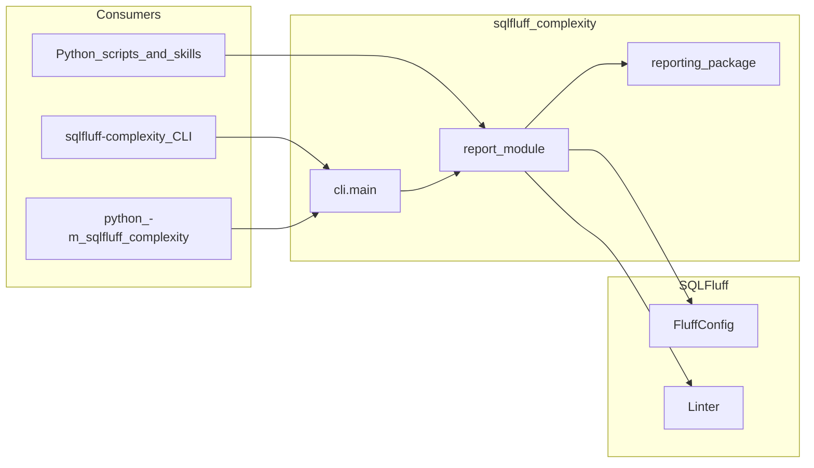
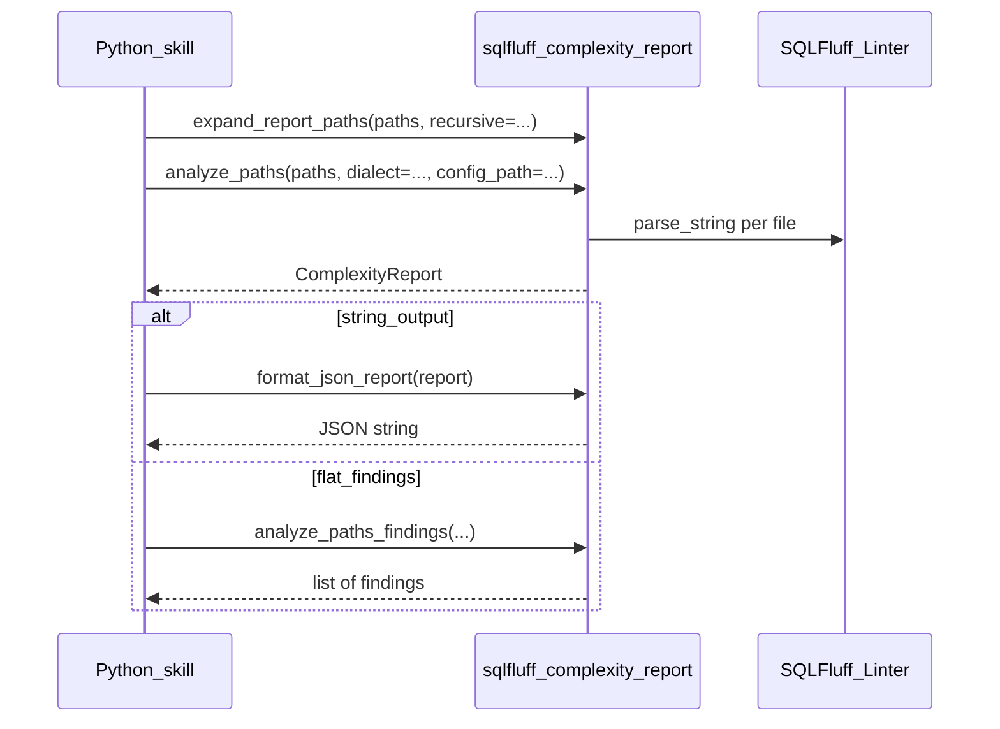

# Python API

Programmatic access to **sqlfluff-complexity** from Python (agent skills, CI glue, internal tools). This page is the home for **stable import paths** that mirror CLI behavior where we document them.

**Requires** the same environment as the CLI: SQLFluff 4.x and this package installed together.

## Scope and evolution

The `sqlfluff-complexity` CLI may gain additional subcommands over time. Each subcommand can expose a matching Python surface (usually a dedicated module or a small set of functions) with the same semantics as the command line.

**Today**, the documented stable programmatic surface for CLI parity is **[`sqlfluff_complexity.report`](#report-command)** (including helpers such as `load_fluff_config` and `validate_cpx_plugin_config` that align with `report`, `config-check`, and config loading). The CLI remains a thin wrapper around those implementations for the `report` flow.

**Going forward**, new subcommands will get their own sections on this page (or linked pages) and their own stable import paths. Do not assume every future API will live under `sqlfluff_complexity.report`; prefer the section headings here and `__all__` on each documented module.

## Report command

Use the **`sqlfluff_complexity.report`** module when you want the same behavior as [`sqlfluff-complexity report`](reporting.md) from Python. The CLI wires argparse to these functions; analysis, thresholds, and output formats match the command line.

### Stable public surface

These names are intended to remain compatible across minor and patch releases. Prefer importing them from `sqlfluff_complexity.report` rather than reaching into `sqlfluff_complexity.core.*` (see [Internal import migration](migration-internal.md)).

| Symbol                                                                                     | Role                                                                      |
| ------------------------------------------------------------------------------------------ | ------------------------------------------------------------------------- |
| `expand_report_paths`                                                                      | Match `--recursive` directory expansion for `.sql` files.                 |
| `analyze_paths`                                                                            | Run analysis; returns `ComplexityReport`.                                 |
| `ComplexityReport`, `ReportEntry`                                                          | Structured per-file metrics, findings, and errors.                        |
| `format_console_report`, `format_json_report`, `format_sarif_report`, `format_html_report` | String outputs aligned with `--format` on the CLI.                        |
| `analyze_paths_findings`                                                                   | Flat `list[ComplexityFinding]` for all paths (canonical shortcut).        |
| `load_fluff_config`, `validate_cpx_plugin_config`                                          | Same loading and validation as `--config` and the `config-check` command. |

Finding and location types (`ComplexityFinding`, `SourceLocation`, and related fields) are defined under [`sqlfluff_complexity.core.messages.findings`](../src/sqlfluff_complexity/core/messages/findings.py). For automation, treat the **JSON shape** documented in [Reporting: JSON](reporting.md#json-report) as the contract for serialized fields; internal helpers under `core` are not part of this stability promise.

### Optional lower-level imports

[`sqlfluff_complexity.reporting`](../src/sqlfluff_complexity/reporting/__init__.py) exposes serializers such as `findings_to_json_payload` and `findings_to_sarif_payload`. Use those when you already have findings and need payloads without going through `analyze_paths`. For parity with `sqlfluff-complexity report`, start from `sqlfluff_complexity.report` first.

### JSON schema version

`format_json_report` emits a top-level `schema_version` (currently **`1.1`**) together with `tool`, `version`, `entries`, and `findings`. If you branch automation on structure, key off `schema_version` and tolerate unknown keys.

### Examples

#### 1. Structured report (branch on metrics or findings)

```python
from pathlib import Path

from sqlfluff_complexity.report import analyze_paths, expand_report_paths

paths = expand_report_paths([Path("models")], recursive=True)
report = analyze_paths(paths, dialect="postgres", config_path=Path(".sqlfluff"))

for entry in report.entries:
    if entry.errors:
        # Parse or read errors; findings include CPX_PARSE_ERROR when applicable
        continue
    assert entry.metrics is not None and entry.score is not None
    # use entry.score, entry.findings, entry.metrics
```

#### 2. Flat findings only

```python
from pathlib import Path

from sqlfluff_complexity.report import analyze_paths_findings

findings = analyze_paths_findings(
    [Path("models/orders.sql")],
    dialect="snowflake",
    config_path=Path(".sqlfluff"),
)
for finding in findings:
    print(finding.rule_id, finding.location.path, finding.location.line, finding.message)
```

#### 3. CLI-equivalent JSON string

```python
import json
from pathlib import Path

from sqlfluff_complexity.report import (
    analyze_paths,
    expand_report_paths,
    format_json_report,
)

paths = expand_report_paths([Path("models/orders.sql")], recursive=False)
report = analyze_paths(paths, dialect="postgres", config_path=Path(".sqlfluff"))
payload = json.loads(format_json_report(report))
assert payload["schema_version"] == "1.1"
```

#### 4. Exact CLI argv behavior (exit codes and stderr)

When you need **argument-for-argument** behavior of the installed CLI (including messages for a directory without `--recursive`), call `main` with an argv list:

```python
import sys

from sqlfluff_complexity.cli import main

raise SystemExit(main(["report", "--dialect", "ansi", "--format", "json", "models/"]))
```

For libraries and most skills, patterns 1–3 are easier to compose and test than parsing CLI output.

### Flow overview (report pipeline)





## See also

- [Reporting](reporting.md): CLI flags, formats, and output semantics for `report`.
- [Configuration](configuration.md): thresholds and `path_overrides`.
- [Internal import migration](migration-internal.md): supported public imports vs `core` layout.
